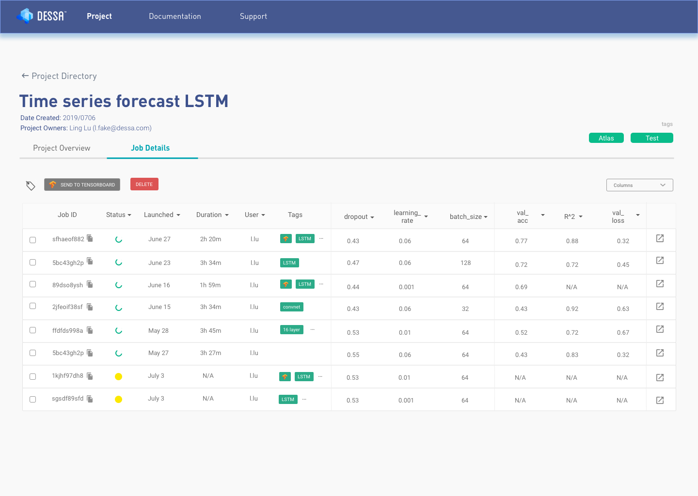

Excited to share that, my team just recently open sourced Atlas. 

Atlas is a flexible Machine Learning platform that consists of a Python SDK, CLI, GUI & Scheduler to help Machine Learning Engineering teams dramatically reduce the model development time & reduce effort in managing infrastructure.

We are still currently in BETA and would love the community's help to ship a flexible, easy to use - ML Platform. 

**Check out and contribute to Atlas in our Github repo: [https://github.com/dessa-oss/atlas](https://github.com/dessa-oss/atlas)**

