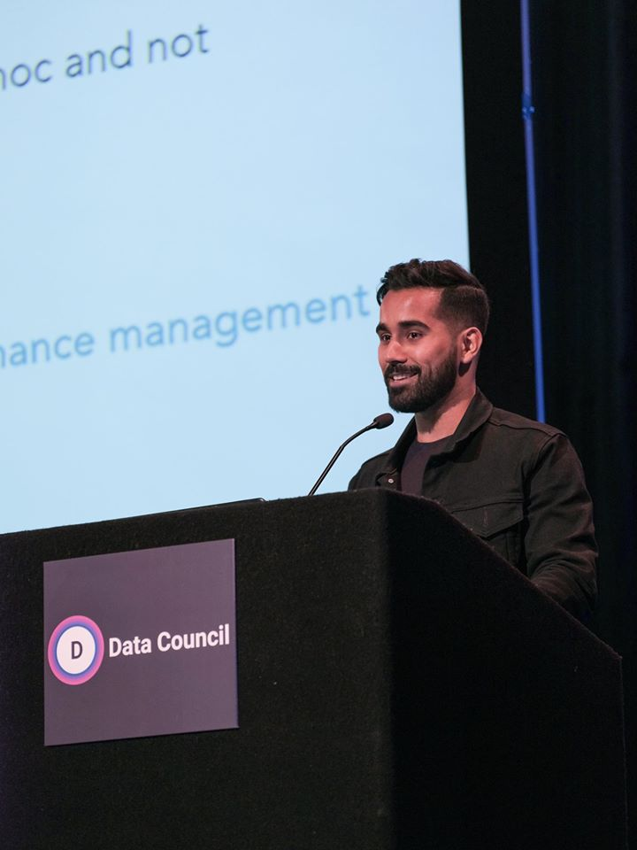

# Hi -

  
  I'm Mohammed, a Product Manager working on Deep Learning Products <a href="www.dessa.com">@Dessa</a> (acquired by <a href="www.squareup.com">@Square</a>).  You can learn more about me <a href="/about">here.</a>.
    
  Or you can reach out to me on <b><a href="https://www.twitter.com/mohammedri_">Twitter</a></b> (DMs open, say hi!).

_This website serves a few purposes:_

- I maintain most of my long form writings here; short form thoughts are usually on [Twitter](https://www.twitter.com/mohammedri_).
- This is my JavaScript/Web development playground
- It also holds several incomplete thoughts under the **#incomplete** header.

## Posts

P.S. In true Zettelkasten style - if you want to view the links between each note in a graph, <a href="/zettelkasten-graph">check this out.</a>.

#### #untagged

- [[Open sourcing Atlas - tools for Applied Deep Learning Development]]
- [[Datacouncil NYC 19' Talk]]
- [[Typefaces - Character Font Image & CSV Dataset]]
- [[Partnering with University of Toronto - CSC 454 - The business of software]]
- [[Various ways the human brain is different from computers ]]

#### #product-management

- [[Kill features that don't work, FAST.]]
- [[Dealing with conflicting priorities on projects that have multiple dependencies on other projects]]

#### #machine-learning

- [[Understanding True Positives, False Positives, True Negatives & False Negatives]]
- [[Precision vs. Recall]]

#### #productivity

- [[Schedule personal distraction time to be able to Deep Work effectively]]
- [[Action is harder but better than reading]]

## Books & Reviews

- [Financial Inclusion at the Bottom of the Pyramid](https://www.goodreads.com/book/show/25992829-financial-inclusion-at-the-bottom-of-the-pyramid)
- [Gang Leader for a Day: A Rogue Sociologist Takes to the Streets](https://www.goodreads.com/book/show/1491906.Gang_Leader_for_a_Day)
- [Dreams from My Father: A Story of Race and Inheritance by Barack Obama](https://www.goodreads.com/book/show/88061.Dreams_from_My_Father)
- [The Bitcoin Standard: The Decentralized Alternative to Central Banking by Saifedean Ammous](https://www.goodreads.com/book/show/36448501-the-bitcoin-standard?from_search=true&from_srp=true&qid=8VoNiV6v62&rank=1)
- [Blockchain: Blueprint for a New Economy by Melanie Swan](https://www.goodreads.com/book/show/24714901-blockchain?from_search=true&from_srp=true&qid=DmFoNmQ7Ql&rank=1)
- [Understanding Michael Porter: The Essential Guide to Competition and Strategy](https://www.goodreads.com/book/show/13263934-understanding-michael-porter?ac=1&from_search=true&qid=DlYcUWMyEg&rank=1)
- [Payments Systems in the U.S. - Third Edition: A Guide for the Payments Professional](https://www.amazon.ca/gp/product/B074PB7T1K/ref=ppx_yo_dt_b_d_asin_title_o01?ie=UTF8&psc=1)
- [Money, Real Quick: The story of M-PESA](https://www.amazon.ca/gp/product/B007FPP7NI/ref=ppx_yo_dt_b_d_asin_title_o02?ie=UTF8&psc=1)
- [Masters of Doom: How Two Guys Created an Empire and Transformed Pop Culture](https://www.amazon.ca/gp/product/B071SDBBXK/ref=ppx_yo_dt_b_d_asin_title_o08aud_?ie=UTF8&psc=1)
- [Financial Intelligence for Entrepreneurs](https://www.amazon.ca/gp/product/1422119157/ref=ppx_yo_dt_b_asin_title_o02_s00?ie=UTF8&psc=1)
- [Escaping the Build Trap: How Effective Product Management Creates Real Value by Melissa Perri](https://www.goodreads.com/book/show/42611483-escaping-the-build-trap?ac=1&from_search=true&qid=uFc54HOrJU&rank=1)
- [Keras to Kubernetes: The Journey of a Machine Learning Model to Production](https://www.amazon.ca/gp/product/B07QTCBWZD/ref=ppx_yo_dt_b_d_asin_title_o07?ie=UTF8&psc=1)
- [The Wright Brothers](https://www.amazon.ca/gp/product/B071FQH2HD/ref=ppx_yo_dt_b_d_asin_title_o01aud_?ie=UTF8&psc=1)
- [Different: Escaping the Competitive Herd](https://www.amazon.ca/gp/product/B072F7ZC7Y/ref=ppx_yo_dt_b_d_asin_title_o04aud_?ie=UTF8&psc=1)
- [The Man Who Mistook His Wife for a Hat: and Other Clinical Tales](https://www.amazon.ca/gp/product/B071F67DCG/ref=ppx_yo_dt_b_d_asin_title_o02aud_?ie=UTF8&psc=1)
- [Obviously Awesome: How to Nail Product Positioning so Customers Get It](https://www.amazon.ca/gp/product/B07PPW5V9C/ref=ppx_yo_dt_b_d_asin_title_o04?ie=UTF8&psc=1)
- [Dreams from My Father: A Story of Race and Inheritance by Barack Obama](https://www.goodreads.com/book/show/88061.Dreams_from_My_Father)
- [The Design of Everyday Things](https://www.amazon.ca/gp/product/B07L5TBRRG/ref=ppx_yo_dt_b_d_asin_title_o09aud_?ie=UTF8&psc=1)
- [Shoe Dog: A Memoir by the Creator of Nike](https://www.amazon.ca/gp/product/B071Z5SL23/ref=ppx_yo_dt_b_d_asin_title_o02aud_?ie=UTF8&psc=1)
- [The Hard Thing About Hard Things: Building a Business When There Are No Easy Answers](https://www.amazon.ca/gp/product/B072HSPZ6V/ref=ppx_yo_dt_b_d_asin_title_o01aud_?ie=UTF8&psc=1)
- [Elon Musk: Tesla, SpaceX, and the Quest for a Fantastic Future by Ashlee Vance](https://www.goodreads.com/book/show/25541028-elon-musk)
- [The Everything Store: Jeff Bezos and the Age of Amazon](https://www.amazon.ca/gp/product/B072FD1MVQ/ref=ppx_yo_dt_b_d_asin_title_o02aud_?ie=UTF8&psc=1)
- [New Power: How Power Works in Our Hyperconnected World—and How to Make It Work for You by Jeremy Heimans](https://www.goodreads.com/book/show/35484894-new-power)
- [Zero to One: Notes on Startups, or How to Build the Future by Peter Thiel](https://www.goodreads.com/book/show/18050143-zero-to-one)
- [Masters of Command: Alexander, Hannibal, Caesar, and the Genius of Leadership](https://www.amazon.ca/gp/product/B072BSXMJL/ref=ppx_yo_dt_b_d_asin_title_o06aud_?ie=UTF8&psc=1)
- [DevOps with Kubernetes: Accelerating software delivery with container orchestrators](https://www.amazon.ca/gp/product/B0711KDB8N/ref=ppx_yo_dt_b_d_asin_title_o02?ie=UTF8&psc=1)
- [Thinking in Systems: A Primer](https://www.amazon.ca/gp/product/B005VSRFEA/ref=ppx_yo_dt_b_d_asin_title_o02?ie=UTF8&psc=1)
- [The Go Programming Language](https://www.amazon.ca/gp/product/0134190440/ref=ppx_yo_dt_b_asin_title_o07_s00?ie=UTF8&psc=1)
- [Design Patterns in Ruby](https://www.amazon.ca/gp/product/B004YW6M6G/ref=ppx_yo_dt_b_d_asin_title_o04?ie=UTF8&psc=1)
- [Metaprograming with Ruby 2](https://www.amazon.ca/gp/product/B00N9I0RMQ/ref=ppx_yo_dt_b_d_asin_title_o02?ie=UTF8&psc=1)
- [Designing Data-Intensive Applications](https://www.amazon.ca/gp/product/B06XPJML5D/ref=ppx_yo_dt_b_d_asin_title_o06?ie=UTF8&psc=1)
- [Hands-On Machine Learning with Scikit-Learn and TensorFlow: Concepts, Tools, and Techniques to Build Intelligent Systems](https://www.amazon.ca/gp/product/1491962291/ref=ppx_yo_dt_b_asin_title_o07_s00?ie=UTF8&psc=1)
- [Deep Learning (Adaptive Computation and Machine Learning series)](https://www.amazon.ca/gp/product/B01MRVFGX4/ref=ppx_yo_dt_b_d_asin_title_o05?ie=UTF8&psc=1)
- [Muhammad: His Life Based on the Earliest Sources by Martin Lings](https://www.goodreads.com/book/show/144925.Muhammad)
- [Principles: Life and Work](https://www.goodreads.com/book/show/34941133-principles)
- [Decisive](https://www.goodreads.com/book/show/19301397-decisive)
- [Never Split the Difference by Chris Voss](https://www.goodreads.com/book/show/26156469-never-split-the-difference)
- [Sapiens: A Brief History of Humankind by Yuval Noah Harari](https://www.goodreads.com/book/show/23692271-sapiens)
- [Sprint](https://www.goodreads.com/book/show/27831864-sprint)
- [High Output Management by Andrew S. Grove](https://www.goodreads.com/book/show/27140043-high-output-management)
- [Surely You’re Joking, Mr. Feynman!: Adventures of a Curious Character by Richard P. Feynman](https://www.goodreads.com/book/show/5544.Surely_You_re_Joking_Mr_Feynman_)
- [Ruby Under a Microscope](https://www.goodreads.com/book/show/16300795-ruby-under-a-microscope)
- [Practical Object Oriented Design in Ruby by Sandi Metz](https://www.goodreads.com/book/show/13507787-practical-object-oriented-design-in-ruby)
- [Walden by Henry David Thoreau](https://www.goodreads.com/book/show/16902.Walden)
- [How to Get Filthy Rich in Rising Asia by Mohsin Hamid](https://www.goodreads.com/book/show/15815364-how-to-get-filthy-rich-in-rising-asia)
- [Siddhartha by Hermann Hesse](https://www.goodreads.com/book/show/52036.Siddhartha)
- [The Madman by Kahlil Gibran](https://www.goodreads.com/book/show/2544.The_Madman)
- [The Time Keeper by Mitch Albom](https://www.goodreads.com/book/show/13624688-the-time-keeper)
- [Steal Like an Artist: 10 Things Nobody Told You About Being Creative by Austin Kleon](https://www.goodreads.com/book/show/13099738-steal-like-an-artist)
- [Don’t Make Me Think, Revisited: A Common Sense Approach to Web Usability by Steve Krug](https://www.goodreads.com/book/show/18197267-don-t-make-me-think-revisited)
- [Man’s Search for Meaning by Viktor E. Frankl](https://www.goodreads.com/book/show/4069.Man_s_Search_for_Meaning)
- [Flashes of Thought: Lessons in life and leadership from the man behind Dubai](https://www.goodreads.com/book/show/24796173-flashes-of-thought)
- [21 Lessons for the 21st Century: Yuval Noah Harari](https://www.amazon.ca/gp/product/B07H43DHV3/ref=ppx_yo_dt_b_d_asin_title_o01aud_?ie=UTF8&psc=1)

