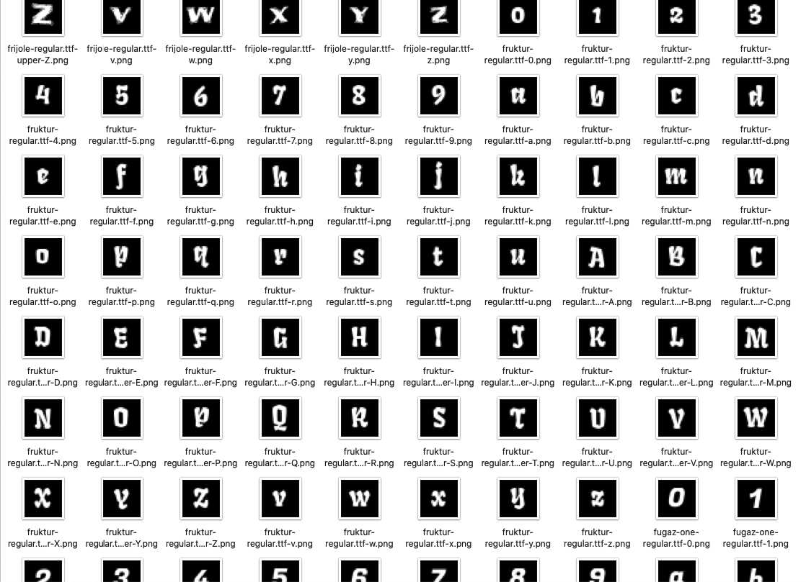
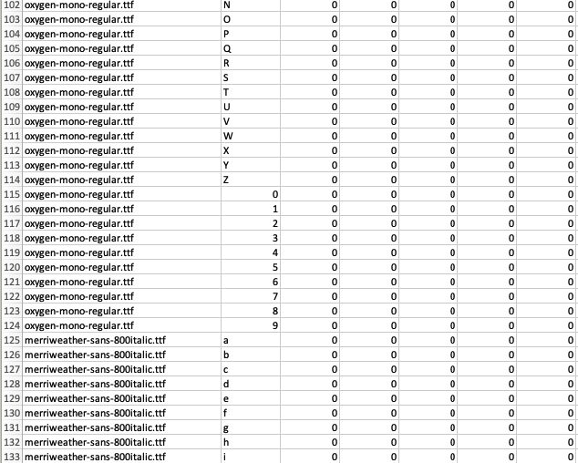

#### A dataset for Machine Learning experiment on Typefaces.

_Download:_
- [Fonts to Character-wise PNG (28x28), alphabets & numbers only](https://console.cloud.google.com/storage/browser/open-fonts-dataset/images)
- [Character-wise PNGs (28x28) to CSV, alphabets & numbers only](https://console.cloud.google.com/storage/browser/open-fonts-dataset/csv)

---

This is a dataset that consists of 2500+ fonts taken from the [Google Fonts](https://fonts.google.com/) database that have been converted to character-wise PNGs and then flattened into a CSV for ML experiments.

I have only considered uppercase / lower case letters and numbers - ignoring other symbols or dingbats.

Each PNG is in greyscale (each pixel can take the value of 0 to 255)) 28x28 pixels in size.



The CSV is formatted similar to [MNIST in CSV](https://pjreddie.com/projects/mnist-in-csv/):

```
font-name, character, pix-11, pix-12, pix-13, ...
```



---

### Bugs? Built something cool?

Reach out [@mohammedri_](https://twitter.com/mohammedri_)

---

Script to generate this dataset from `.ttf` files:
```python
image_width = 28
image_height = 28

characters = list(string.ascii_letters + string.digits) # Characters to consider, ignoring symbols

with open(csv_dataset_folder + "/" + "google_fonts_dataset.csv", 'w', newline='') as file:
    writer = csv.writer(file, dialect="excel")
    
    for font_file in ttf_files:
        print(font_file)

        font_name = font_file.split("/")[-1]

        font = ImageFont.truetype(font_file, 20, encoding="unic")

        for character in characters:    
            image = Image.new('L', (image_width,image_height), "black")
            draw = ImageDraw.Draw(image)
            text_width, text_height = draw.textsize(character, font=font)

            offset = font.getoffset(character)

            draw.text(
                ((image_width-(text_width+offset[0]))/2,(image_height-(text_height+offset[1]))/2), 
                character, 
                fill='white', 
                font=font
            )

            row = list(image.getdata())
            row.insert(0, character)
            row.insert(0, font_name)
            
            writer.writerow(row)
            
            if character.isupper():
                image.save(dataset_dir + "/" + images_dir + f"/{font_name}-upper-{character}.png", "PNG")
            else:
                image.save(dataset_dir + "/" + images_dir + f"/{font_name}-{character}.png", "PNG")
```